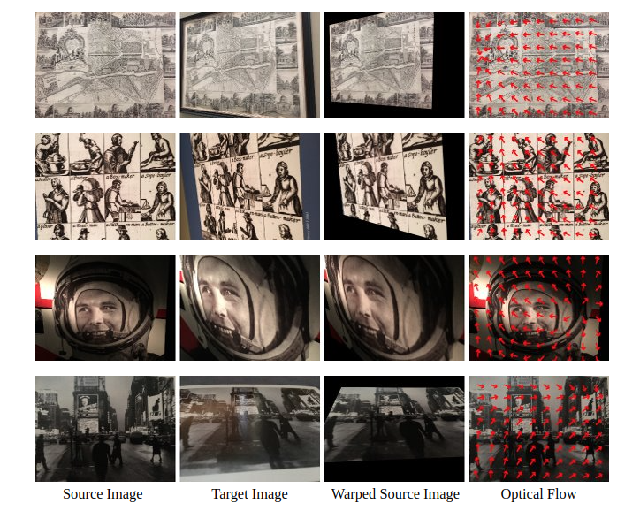

# HomoRAFT

This is the code of homography estimation model for my semester project at the ETH-Zurich. HomoRAFT is a deep learning model used to estimate
homography between two images. The main structure is based on the [RAFT](https://github.com/princeton-vl/RAFT).




## Dependencies
If training with Synthetic MS-COCO dataset, please install the latest version of OpenCV, PyTorch and Kornia.

## Training
To train the model, you need to first download the [MS-COCO dataset](https://cocodataset.org/#home), then change the config
file to point to the correct path. Then, you can run the following command to train the model:

```bash
python train.py --config_file configs/raft-easy.yaml
```


## Evaluation
To evaluate the model, first download the [HPatch](https://github.com/hpatches/hpatches-dataset), then run the following command:

```bash
python evaluation/evaluate_hpatch.py --image-data-path <path-to-hpatch> --ckpt <path-to-model>
```

Weight can be downloaded from [here](https://drive.google.com/drive/folders/1A1cwiukoyBZQyctbW2jhPg87aBRVNFvW?usp=share_link)

